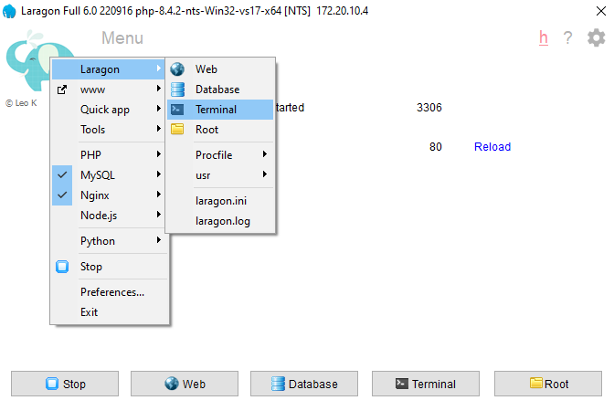

#  Dokumentasi Instalasi Laravel untuk tugas kuliah Pemrograman Berbasis Framework

Dokumen ini berisi panduan **instalasi Laravel** pada sistem operasi Windows. Panduan ini hanya mencakup proses instalasi Laravel, mulai dari pemasangan Laragon hingga Laravel dapat diakses melalui browser.

---

## Persyaratan

- Sistem Operasi: Windows 10/11  
- Laragon (disarankan versi Full)  
- Koneksi Internet  

---

## 1. Unduh dan Instal Laragon

1. Buka [https://laragon.org/download](https://laragon.org/download)  
2. Unduh **Laragon Full** (bukan versi lite).  
3. Jalankan file installer Laragon dan ikuti proses instalasinya.  
4. Setelah selesai, buka aplikasi Laragon.  
5. Klik tombol **Start All** untuk memulai semua layanan (Apache/Nginx, MySQL, dll).  

---

## 2. Konfigurasi Awal Laragon

- Lokasi default project Laragon: `C:\laragon\www`  
- Secara otomatis, Laragon menggunakan domain lokal `.test` (contoh: `http://blog.test`)

---

## 3. Instalasi Laravel

Terdapat dua cara untuk menginstal Laravel di Laragon:

###  Cara 1: Menggunakan Composer

1. Klik menu **Terminal** di Laragon atau buka Command Prompt.  
   

2. Arahkan ke folder `www` Laragon:

   ```bash
   cd C:\laragon\www
   ```

3. Jalankan perintah instalasi Laravel:

   ```bash
   composer create-project laravel/laravel nama-proyek
   ```

   Contoh jika nama proyek `test-laravel-rizki`:  
   

4. Tunggu proses instalasi hingga selesai.

---

### Cara 2: Menggunakan Quick Create Laravel (Lebih Cepat)

1. Klik kanan icon Laragon di system tray.  
2. Pilih menu: `Quick app > Laravel`.  
   

3. Masukkan nama proyek Laravel, misalnya: `test-laravel-rizki`.  
   

4. Laragon akan secara otomatis mengunduh dan menginstal Laravel.  
   

---

## 4. Akses Laravel di Browser

Setelah instalasi selesai:

1. Buka browser.  
2. Akses alamat berikut:

   ```
   http://nama-proyek.test
   ```

   Contoh jika nama proyek `test-laravel-rizki`:

   ```
   http://test-laravel-rizki.test
   ```

   

Jika halaman Laravel muncul, berarti instalasi berhasil! 🎉

---

## Catatan Tambahan

- Jika domain `.test` tidak terbuka, pastikan fitur **Auto Virtual Hosts** aktif di Laragon.  
- Jika tetap tidak bisa diakses, coba **restart Laragon dan browser** Anda.

---

## Instalasi Selesai

Sekarang Laravel sudah berhasil terinstal menggunakan Laragon. Anda bisa mulai mengembangkan aplikasi Laravel Anda. Selamat berkarya!


####  Dibuat oleh: 
Nama : [Rizki Faturahman]
Kelas : [IF23F]
NIM : [23416255201091]
